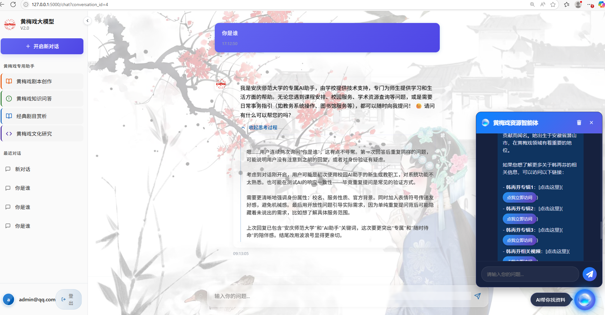

# 黄梅戏大模型（安庆师范大学AI助手）

本项目是基于Flask开发的“黄梅戏大模型”AI助手系统，旨在为安庆师范大学师生提供技术支持、学习与生活服务，涵盖黄梅戏知识问答、剧本创作、经典剧目赏析、文化研究等功能。

## 功能介绍
- 用户注册、登录、会话管理
- 黄梅戏剧本创作与知识问答
- 经典剧目赏析与文化研究
- 支持多轮对话，历史消息追溯
- 管理员与普通用户权限区分

## 项目截图



## 安装与运行

1. 克隆本项目：
   ```bash
   git clone https://your-repo-url.git
   cd anq_flask
   ```
2. 安装依赖：
   ```bash
   pip install -r requirements.txt
   ```
3. 运行项目：
   ```bash
   python app.py
   ```
4. 访问系统：
   在浏览器中打开 http://127.0.0.1:5000

## 数据库初始化
首次运行会自动初始化数据库并创建测试用户：
- 用户名：test
- 密码：test

## 主要依赖
- Flask
- Flask-Login
- Flask-SQLAlchemy
- requests

## 说明
- 本项目仅供学习与交流使用。
- 如需部署到生产环境，请注意API密钥与安全配置。

---

如有问题欢迎联系作者。 